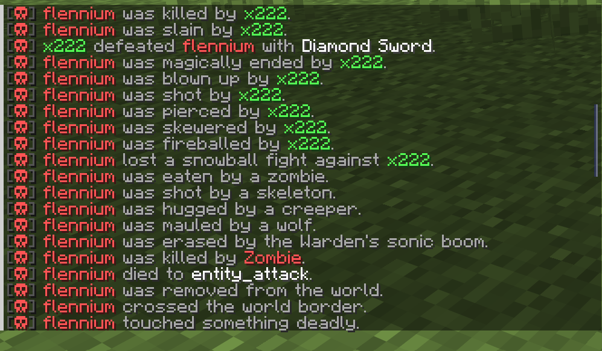
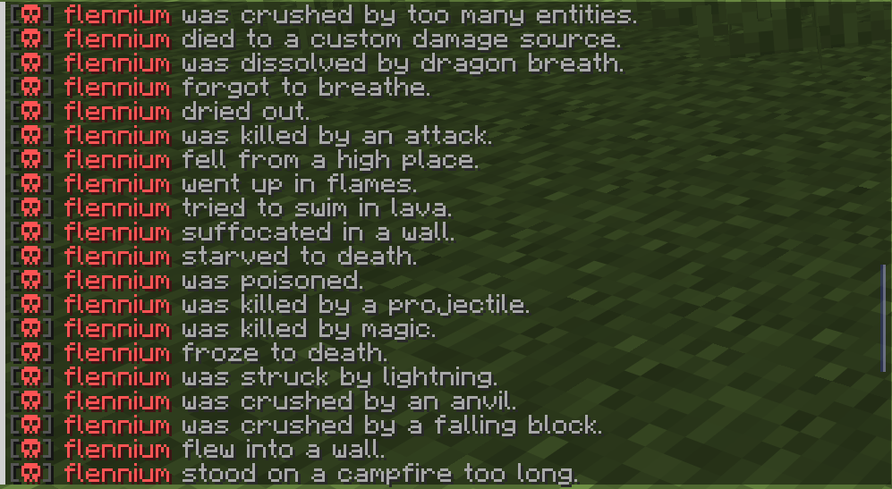
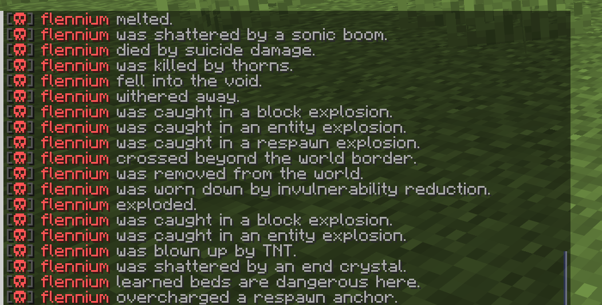
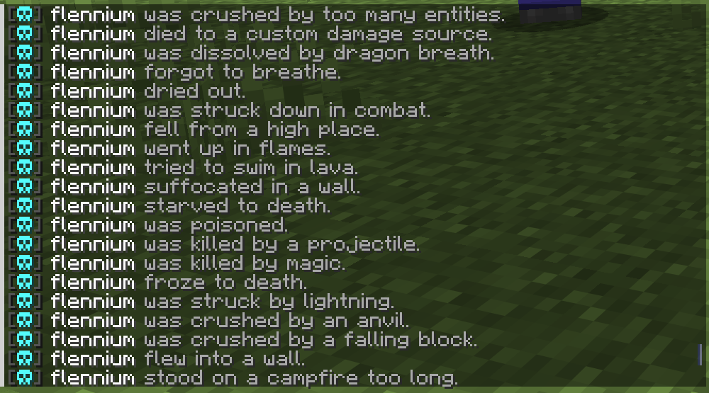
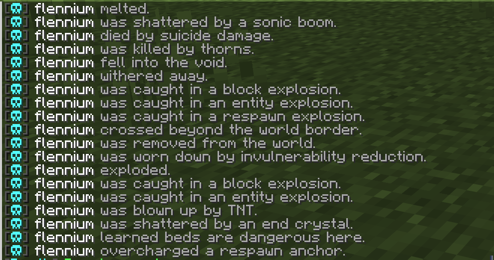
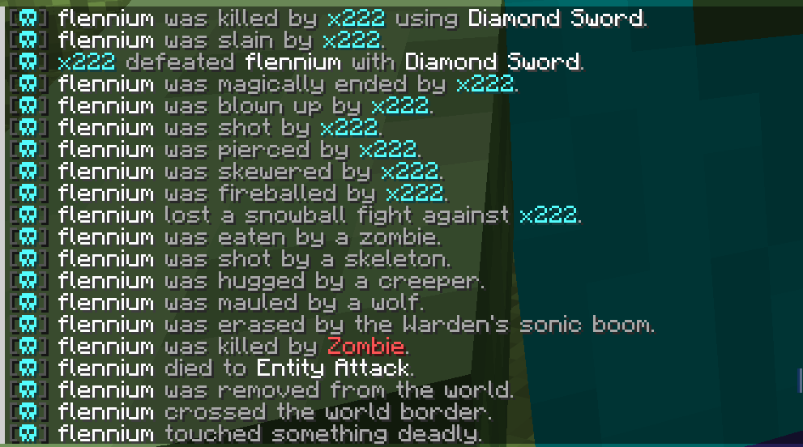
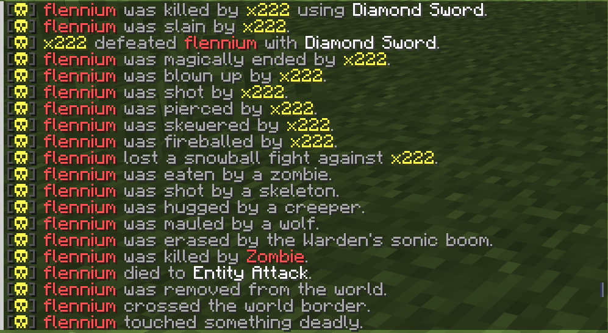
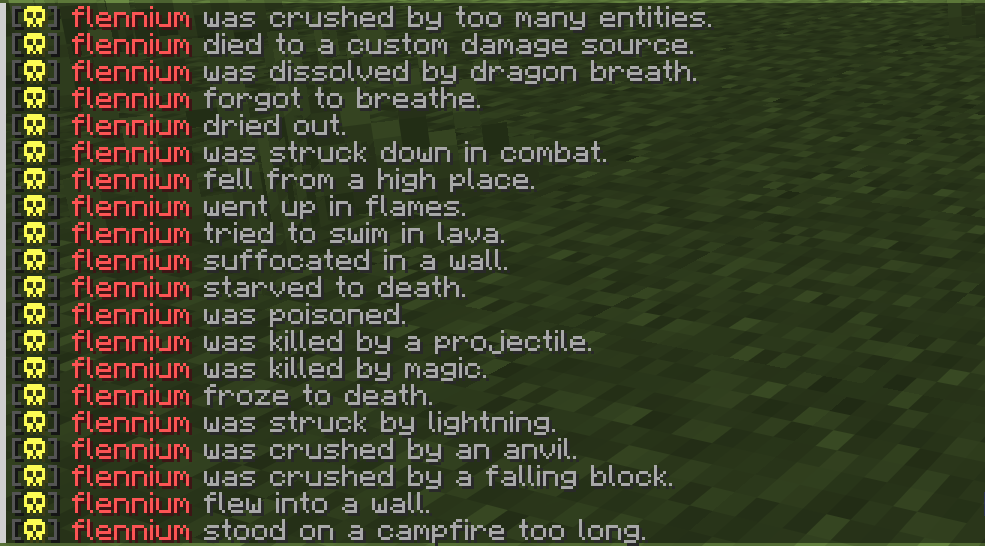

# LightDeathMessages

LightDeathMessages is a lightweight, configurable Minecraft death messages plugin for modern Paper/Spigot servers. It replaces vanilla death messages with clean custom messages, supports themes, PlaceholderAPI, broadcast controls, and safe fallbacks for current and future damage types.

## Why It Is Different

Most death message plugins either feel heavy, mix settings with messages, or depend too much on version-specific behavior. LightDeathMessages is built to stay simple: configs are cached, death events stay lightweight, themes are file-based, vanilla messages are hidden safely, and unknown/custom damage types fall back without crashing your server.

## Screenshots

Preview the plugin in-game with real chat output and theme examples.

| Death Messages | More Death Messages |
| --- | --- |
|  |  |
|  |  |
|  |  |

| Theme Showcase | More Theme Showcase |
| --- | --- |
|  |  |

## Features

- Custom death messages for PvP, mobs, projectiles, explosions, environment deaths, and unknown/custom damage.
- Global, world-only, radius-based, or disabled broadcasts.
- PlaceholderAPI support when installed.
- Legacy color support and safe formatting fallback.
- Command-only prefix messages.
- Death messages with literal skull icons in the message strings.
- Built-in themes plus unlimited custom themes.

## Themes

Themes live in:

```text
plugins/LightDeathMessages/themes/
```

To add your own theme, create a new file such as:

```text
plugins/LightDeathMessages/themes/random.yml
```

Then select it in `config.yml`:

```yaml
themes:
  selected-theme: random
```

No Java code changes are needed for custom themes. The plugin scans the themes folder and can load any valid `.yml` theme by file name.

## Commands

```text
/deathmessages help
/deathmessages reload
/deathmessages version
/deathmessages test <type|all> [self|global|world|radius|disabled]
/deathmessages theme list
/deathmessages theme preview <theme>
/deathmessages theme apply <theme>
```

Aliases:

```text
/dm
/deathmsg
```

## Building

Requirements:

- Java 21
- Maven

```bash
mvn clean package
```


